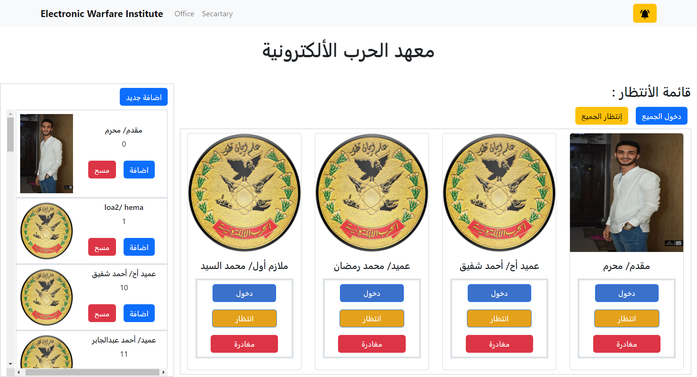
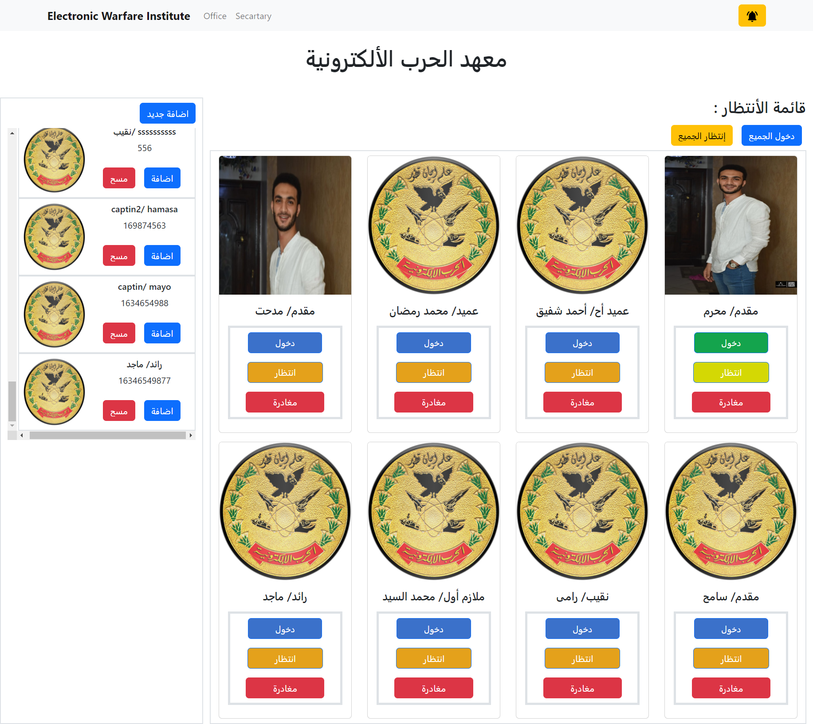
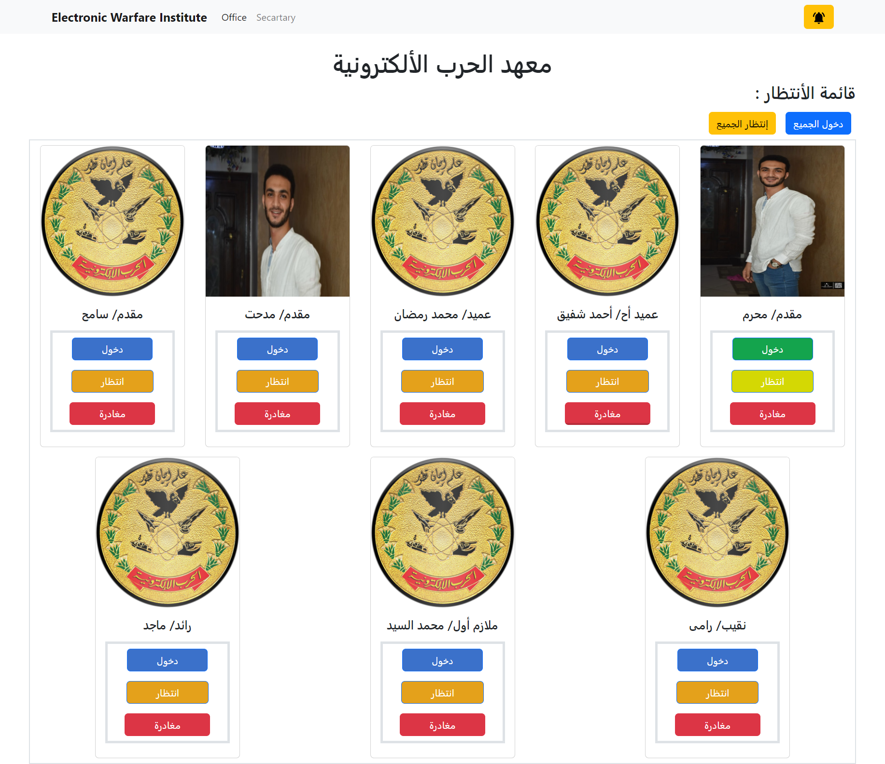

# share-screen-app
#### **Be sure it is Suitable for your office** 

## Objective :
**Facilitates the secartary work, enables the secartary to take permission for the visitors to get in the manager office without real contact betwwen the
secartary and the manager**

### Backend :
the backend end is developed with **express** and **nodejs** while the **file system** is used as database.  
### Frontend :
the frontend is developed with reactjs and redux to keep tracking of the changes.
Secartary page : 

**------------------------------------------------------------------------------------------------------------------------------**
Secartary page expanded :

manager office page:

